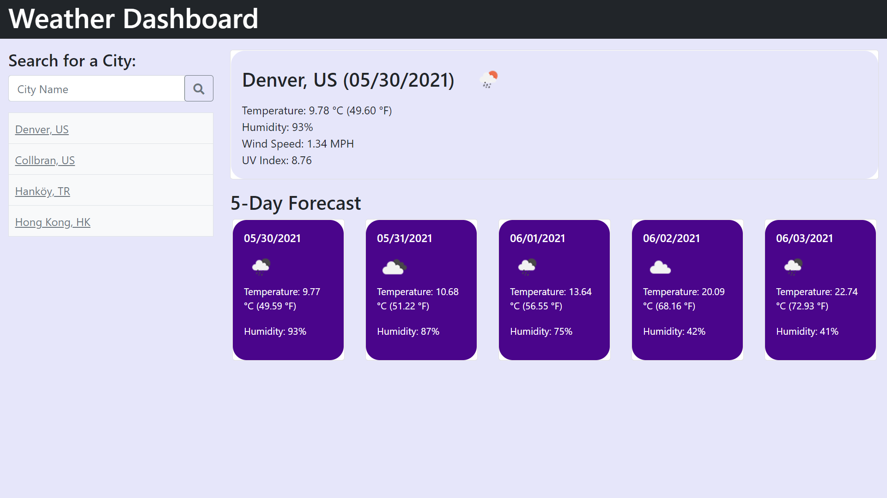

*Welcome to my 6th homework project!*

Index.html:
I began by setting up my html and getting a basic page layout decidecd. I chose the bootstrap components I needed and adjusted general component layout. I then linked the api's and my other files. Wasn't much to do here, but I am becoming more familiar with webpage layout so this is becoming easier.

Style.css:
With this I started by choosing the colors I'd like to use (purple as usual.) I actually worked on responisiveness at the same time as my html and discovered a somewhat "universal" method for making a page responsive for most web browsers. It uses a combination of media queries and bootstrap html classes, seems to work so far.

Script.js:
With this page I began by designating variables to use for all the functions. I then decided to get the local storage functionality out of the way as it is always the most frustrating. This was a matter of setting up the functions to: allow searches, save search input, retrieve search data, save search data, and display it all in the desired place. Respectively. Within all of that was designating functions for my api calls that would retrieve all necessary weather data for relevant dates. Proofreading my syntax in the for loop I used for the five day forcast was ultimately what completed the page and got everything working, my aha moment if you will. This project was challenging though I can tell all of these concepts are becoming more familiar.

